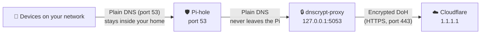

# ☁️ Raspberry Pi 5 – Encrypted DNS (DNS-over-HTTPS) for Pi-hole with Cloudflare

**Last updated:** October 2026
**Author:** Jeffrey Som
**Tags:** Raspberry Pi, Pi-hole, Cloudflare, DNS-over-HTTPS, DoH, dnscrypt-proxy, Privacy, Network Security

> [!IMPORTANT]
> **Earlier versions of this guide used `cloudflared proxy-dns`. That no longer works.**
> Cloudflare removed the `proxy-dns` feature in cloudflared **2026.2.0** (February 2026), so the latest cloudflared download can't act as a DNS proxy anymore. This guide now uses **dnscrypt-proxy**, the method recommended in the Pi-hole documentation. **You still use Cloudflare's resolver over DNS-over-HTTPS.** Only the program on your Pi changes.
> If you set up the old version, start with [Step 0](#-step-0-remove-the-old-cloudflared-setup-only-if-you-followed-the-old-guide).

---

## 📝 Overview

### The problem
Pi-hole blocks ads and trackers, but it does not resolve domain names itself. It **forwards** every allowed query to an upstream DNS server such as Cloudflare or Google. By default, those forwarded queries travel as **plain, unencrypted DNS** over UDP port 53. That means:

- Your **ISP** (or anyone else between you and the DNS server) can see every domain your household looks up.
- Someone on that path can **tamper** with the answers and send you to the wrong site.

### The fix
**DNS-over-HTTPS (DoH)** wraps DNS queries inside normal encrypted HTTPS traffic (port 443). To an outside observer, it looks like ordinary web traffic, and its contents can't be read or changed.

Pi-hole doesn't speak DoH itself, so we run a small local helper called **dnscrypt-proxy** on the Pi. Pi-hole sends queries to it, and it encrypts them and sends them to Cloudflare.

### What this does and does not do
| ✅ It does | ❌ It does not |
|---|---|
| Hide your DNS lookups from your ISP and the network path | Make you anonymous. Your ISP can still see which IP addresses you connect to |
| Stop DNS answers from being tampered with in transit | Hide your queries from Cloudflare. You are moving your trust from your ISP to Cloudflare |
| Work for every device that uses your Pi-hole | Cover devices or apps that bypass Pi-hole with their own DNS settings |

---

## 🧭 How It Works



Queries are unencrypted only on your local network and inside the Pi itself, where outsiders can't see them. Everything that leaves your house is encrypted.

---

## 🚀 What You'll Need

- ✅ Raspberry Pi 5 running **Raspberry Pi OS** (Bookworm or newer)
- ✅ **Pi-hole** installed and working (this guide assumes Pi-hole v6; v5 differences are noted)
- ✅ Internet access
- ✅ Terminal access (SSH or keyboard and monitor)

---

## 🧹 Step 0: Remove the Old cloudflared Setup (only if you followed the old guide)

Skip this step if you never installed cloudflared.

The old service listens on port **5053**, the same port dnscrypt-proxy will use. Two programs can't listen on the same port, so remove the old one first:

```bash
# Stop the service and prevent it from starting at boot
sudo systemctl disable --now cloudflared

# Remove the service file, config file, and binary
sudo rm -f /etc/systemd/system/cloudflared.service
sudo rm -f /etc/default/cloudflared
sudo rm -f /usr/local/bin/cloudflared

# Tell systemd the service file is gone, then remove the service user
sudo systemctl daemon-reload
sudo userdel cloudflared
```

> [!NOTE]
> If you use cloudflared for **Cloudflare Tunnel** (to expose services remotely), you only need to remove the DNS proxy pieces above. Tunnels still work in current releases.

---

## ⚙️ Step 1: Update Your System

```bash
sudo apt update && sudo apt full-upgrade -y
```

**Why:** `apt update` refreshes the list of available packages, and `full-upgrade` installs the latest versions. Starting from a fully updated system avoids version conflicts and makes sure you have current security patches.

---

## 📥 Step 2: Install dnscrypt-proxy

```bash
sudo apt install dnscrypt-proxy -y
```

**Why install it from `apt`:** Installing from the official repository means:
- It updates automatically with your normal `sudo apt upgrade`. A manually downloaded binary never updates unless you do it yourself.
- The package sets up the system service and a dedicated low-privilege user for you. You don't need to write any service files by hand.

**What is dnscrypt-proxy?** It's a lightweight, open-source DNS proxy that supports encrypted DNS protocols, including DoH. It works with Cloudflare and many other providers, so you aren't locked in to one company.

---

## 🔌 Step 3: Move dnscrypt-proxy to Port 5053

**Why:** Pi-hole already uses **port 53**, the standard DNS port. dnscrypt-proxy needs its own port, so we put it on **5053** and only on `127.0.0.1` (localhost). Using localhost means only programs running on the Pi itself can reach it. Your other devices keep talking to Pi-hole, not directly to the proxy.

On Debian-based systems, dnscrypt-proxy uses **systemd socket activation**: systemd opens the listening port and hands it to dnscrypt-proxy. So we change the port in the socket settings, not in the program's own config file.

Open an override file for the socket:

```bash
sudo systemctl edit dnscrypt-proxy.socket
```

Paste the following into the editable area (between the comment lines at the top):

```ini
[Socket]
ListenStream=
ListenDatagram=
ListenStream=127.0.0.1:5053
ListenDatagram=127.0.0.1:5053
```

**What these lines mean:**
- The empty `ListenStream=` and `ListenDatagram=` lines **clear** the package's default address. Without them, systemd would listen on both the old and new addresses.
- `ListenStream` is for TCP, and `ListenDatagram` is for UDP. DNS uses both, so we set both.

Save and exit (in nano: `Ctrl+O`, `Enter`, `Ctrl+X`), then reload systemd so it picks up the change:

```bash
sudo systemctl daemon-reload
```

---

## 🛠️ Step 4: Choose Cloudflare as the Upstream Resolver

Open the dnscrypt-proxy configuration file:

```bash
sudo nano /etc/dnscrypt-proxy/dnscrypt-proxy.toml
```

Make sure these two lines are near the **top** of the file. Debian's default config may already contain them:

```toml
# Empty because systemd socket activation handles listening (see Step 3)
listen_addresses = []

# Which encrypted DNS server(s) to use
server_names = ['cloudflare']
```

**Why `listen_addresses = []`:** Systemd already opened port 5053 in Step 3. If dnscrypt-proxy also tried to open a port, the two would conflict.

> [!WARNING]
> In TOML files, settings like `server_names` must appear **above** the first `[section]` header (such as `[sources]`). If you place them below a section header, they're treated as part of that section and ignored.

### Picking a Cloudflare resolver

| `server_names` value | What it does |
|---|---|
| `'cloudflare'` | Standard Cloudflare DNS (1.1.1.1). No filtering |
| `'cloudflare-security'` | Also blocks known malware domains |
| `'cloudflare-family'` | Blocks malware **and** adult content |

You can list more than one, for example `['cloudflare', 'quad9-doh-ip4-port443-filter-pri']`. dnscrypt-proxy measures their speed and uses the fastest. See the full list at [dnscrypt.info/public-servers](https://dnscrypt.info/public-servers/).

### Optional: Use a Cloudflare Zero Trust (Gateway) DoH endpoint

If you have a Cloudflare Zero Trust account, you can send queries to your personal Gateway endpoint (`https://<your-gateway-id>.cloudflare-gateway.com/dns-query`). This applies your own filtering policies and gives you logs in the Cloudflare dashboard.

1. Go to the [DNS Stamp calculator](https://dnscrypt.info/stamps/) and choose **DNS-over-HTTPS**.
2. Enter `<your-gateway-id>.cloudflare-gateway.com` as the host name and `/dns-query` as the path.
3. Copy the generated `sdns://...` stamp. A stamp is a compact string that tells dnscrypt-proxy how to reach and verify a server.
4. Add this to the **end** of the config file. If a `[static]` line already exists, put your entry under it instead of adding a second `[static]` line:

```toml
[static]
  [static.'my-gateway']
  stamp = 'sdns://PASTE_YOUR_STAMP_HERE'
```

5. Change the top of the file to `server_names = ['my-gateway']`.

> [!CAUTION]
> Don't commit your real Gateway ID to a public repository. It's tied to your Cloudflare account and policies. Use a placeholder like `<your-gateway-id>` in shared docs.

### Optional: Turn off duplicate query logging

If your config has an active `[query_log]` section, dnscrypt-proxy writes **every** lookup to a file in `/var/log`. Pi-hole already keeps a query log, so this is redundant. It also adds extra writes to your SD card and keeps another copy of your browsing history. To disable it, put a `#` in front of the `[query_log]` line and the `file = ...` line below it.

### Apply the changes

Save and exit, then restart both the socket and the service:

```bash
sudo systemctl restart dnscrypt-proxy.socket dnscrypt-proxy.service
sudo systemctl status dnscrypt-proxy
```

You should see **`active (running)`** in green. Press `q` to exit the status view.

---

## 🧪 Step 5: Test dnscrypt-proxy Directly

Install `dig`, a DNS testing tool, if you don't already have it:

```bash
sudo apt install bind9-dnsutils -y
```

Ask dnscrypt-proxy directly (bypassing Pi-hole) to look up a domain:

```bash
dig @127.0.0.1 -p 5053 cloudflare.com
```

**What the parts of this command mean:**
- `@127.0.0.1` sends the query to this Pi.
- `-p 5053` sends it to port 5053 (dnscrypt-proxy) instead of the default port 53 (Pi-hole).

**What to look for in the output:**
- `status: NOERROR` near the top
- An `ANSWER SECTION` containing IP addresses
- `SERVER: 127.0.0.1#5053` near the bottom

This confirms dnscrypt-proxy is running and can reach Cloudflare. **Test this before changing Pi-hole.** If you point Pi-hole at a proxy that isn't working, DNS stops working for your whole network.

---

## ⚙️ Step 6: Point Pi-hole at dnscrypt-proxy

### Option A: Web interface

1. Open the Pi-hole admin panel and go to **Settings → DNS**.
2. Under **Upstream DNS Servers**, **uncheck every box** (Google, Cloudflare, Quad9, and so on).
3. In the **Custom DNS servers** box, enter:
```
   127.0.0.1#5053
```
4. Click **Save & Apply**.

> On **Pi-hole v5**, the field is called **Custom 1 (IPv4)** instead, and the button is **Save**.

### Option B: Command line (Pi-hole v6)

```bash
sudo pihole-FTL --config dns.upstreams '["127.0.0.1#5053"]'
```

**Why uncheck all the other servers:** Pi-hole spreads queries across **every** enabled upstream. If any public server stays checked, some of your queries still go out unencrypted, which defeats the purpose.

**Why the `#`:** That's Pi-hole's notation for "IP address, then port." `127.0.0.1#5053` means "localhost, port 5053." It's the same thing `dig` meant by `@127.0.0.1 -p 5053`.

---

## 🔎 Step 7: Confirm It's Working End to End

**1. Test through Pi-hole** (no `-p`, so this uses port 53):

```bash
dig @127.0.0.1 pi-hole.net
```

A `NOERROR` answer means the full chain works: Pi-hole → dnscrypt-proxy → Cloudflare.

**2. Check Pi-hole's Query Log** in the admin panel. Allowed queries should show they were forwarded to `127.0.0.1#5053`.

**3. Check from a device on your network.** On a phone or computer that uses Pi-hole for DNS, visit **[https://1.1.1.1/help](https://1.1.1.1/help)**. You should see:
- **Using DNS over HTTPS (DoH): Yes**

> [!TIP]
> For an accurate result, temporarily turn off your browser's own "Secure DNS" setting. If the browser is doing its own DoH, it bypasses Pi-hole entirely, and this page would say "Yes" even if your Pi-hole setup were broken.
> If you used a Zero Trust Gateway endpoint, this page may not report "Yes." Check the Gateway DNS logs in your Cloudflare dashboard instead.

---

## 🩺 Troubleshooting

| Symptom | Likely cause and fix |
|---|---|
| `dig ... -p 5053` times out or says "connection refused" | dnscrypt-proxy isn't listening. Run `sudo ss -lunp \| grep 5053` and `systemctl status dnscrypt-proxy.socket`. Recheck Step 3 |
| "Address already in use" in the logs | Something else, often the old cloudflared, is on port 5053. Do Step 0 |
| Service fails after editing the config | Usually a typo or a setting placed below a `[section]`. Run `sudo journalctl -u dnscrypt-proxy -n 50` to see the exact error |
| Everything worked, then broke after a reboot | Check the clock with `timedatectl`. Encrypted connections fail if the system time is wrong. The Pi 5's real-time clock only keeps time with an optional battery |
| Whole network lost DNS | Temporarily re-check a public upstream in Pi-hole (Step 6) to restore internet access, then fix dnscrypt-proxy |

---

## 🔄 Keeping It Updated

Because dnscrypt-proxy came from `apt`, your regular updates cover it:

```bash
sudo apt update && sudo apt upgrade -y
```

dnscrypt-proxy also refreshes its list of public resolvers in the background, so you don't need to maintain it.

---

## ❓ FAQ

**Why not use cloudflared anymore?**
Cloudflare removed its DNS proxy feature (`proxy-dns`) in cloudflared 2026.2.0, citing a security issue in an underlying library. Older versions still run, but Cloudflare only supports each release for one year. Pinning an old, unpatched version on your network's DNS server isn't a good long-term plan.

**Is this the same as DNS-over-TLS (DoT)?**
Similar goal, different packaging. DoT encrypts DNS on its own dedicated port (853), which makes it easy to identify and block. DoH uses port 443 like normal web traffic, so it blends in.

**What about Unbound?**
Unbound is a different approach. Instead of trusting one provider like Cloudflare, your Pi looks up domains itself by talking directly to the authoritative servers on the internet. You don't share all of your queries with a single company, but those queries aren't encrypted. Which is better depends on whether you're more concerned about your ISP seeing your lookups (use DoH) or one provider seeing all of them (use Unbound).

---

## 📚 References

- [Pi-hole docs: dnscrypt-proxy (DoH)](https://docs.pi-hole.net/guides/dns/dnscrypt-proxy/)
- [Cloudflare changelog: cloudflared proxy-dns removal](https://developers.cloudflare.com/changelog/2025-11-11-cloudflared-proxy-dns/)
- [dnscrypt-proxy documentation](https://github.com/DNSCrypt/dnscrypt-proxy/wiki)
- [DNS Stamp calculator](https://dnscrypt.info/stamps/)
- [Cloudflare 1.1.1.1 connection test](https://1.1.1.1/help)

---

✅ **Done!** Your Pi-hole now blocks ads **and** sends all of its DNS lookups to Cloudflare over an encrypted connection.
